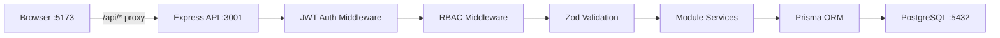
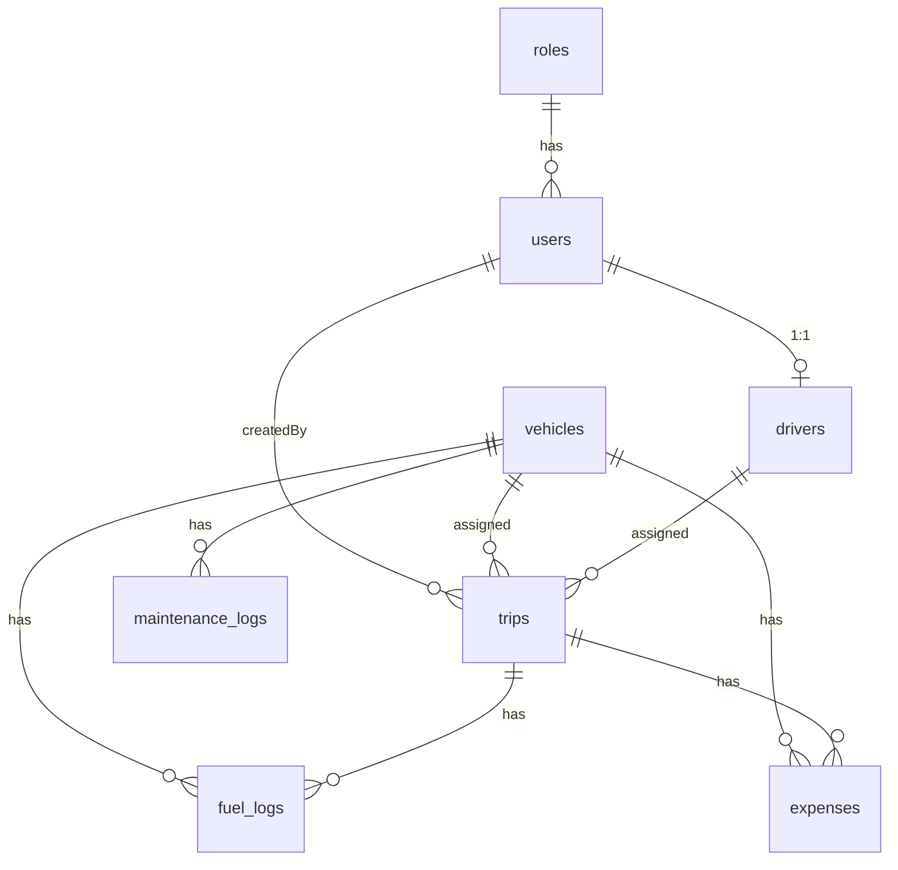

# TransitOps — Full Codebase Analysis

## Overview

**TransitOps** is a full-stack transport operations platform built for an **8-hour hackathon**. It digitizes vehicle, driver, dispatch, maintenance, and expense management with enforced business rules and operational analytics.

| Aspect | Detail |
|---|---|
| **Stack** | PostgreSQL → Prisma ORM → Express.js → React (Vite) + Tailwind CSS v4 |
| **Auth** | JWT + bcrypt, RBAC with 4 roles |
| **Data Fetching** | TanStack Query (React Query) |
| **Charts** | Recharts |
| **Deploy** | Docker Compose (PostgreSQL + Node) |

---

## Architecture Diagram



---

## Database Schema (8 Entities)



| Entity | Key Fields | Status Enum |
|---|---|---|
| **roles** | `name` (FLEET_MANAGER, DRIVER, SAFETY_OFFICER, FINANCIAL_ANALYST) | — |
| **users** | email (unique), passwordHash, roleId FK | — |
| **vehicles** | registrationNumber (unique, indexed), maxLoadCapacity (DECIMAL), acquisitionCost (DECIMAL) | AVAILABLE, ON_TRIP, IN_SHOP, RETIRED |
| **drivers** | licenseNumber (unique), licenseExpiryDate (indexed), safetyScore (DECIMAL) | AVAILABLE, ON_TRIP, OFF_DUTY, SUSPENDED |
| **trips** | source, destination, cargoWeight (DECIMAL), plannedDistance, actualDistance | DRAFT, DISPATCHED, COMPLETED, CANCELLED |
| **maintenance_logs** | vehicleId, description, cost (DECIMAL) | OPEN, CLOSED |
| **fuel_logs** | vehicleId, tripId (nullable), liters, cost (DECIMAL) | — |
| **expenses** | vehicleId (nullable), tripId (nullable), type (TOLL/MAINTENANCE/OTHER) | — |

> [!TIP]
> All money fields use `DECIMAL` (not FLOAT) — correct for financial calculations. All status fields are indexed for dashboard query performance.

---

## Backend Architecture

### Module Structure (Routes → Controller → Service)

Every module follows a consistent **4-file pattern**:

```
modules/<name>/
  ├── <name>.routes.js        # HTTP routing + middleware wiring
  ├── <name>.controller.js    # Orchestration, HTTP in/out
  ├── <name>.service.js        # Business logic + DB transactions
  └── <name>.schema.zod.js     # Request body validation schemas
```

### Middleware Stack

| Middleware | File | Purpose |
|---|---|---|
| Helmet | `app.js` | Security headers |
| CORS | `app.js` | Origin whitelist (`CLIENT_URL`) |
| Morgan | `app.js` | Request logging |
| **authenticate** | [auth.js](file:///d:/odoo-8hr/server/src/middleware/auth.js) | JWT verification, sets `req.user` |
| **authorize** | [rbac.js](file:///d:/odoo-8hr/server/src/middleware/rbac.js) | Role-based access, 403 on forbidden |
| **validate** | [validate.js](file:///d:/odoo-8hr/server/src/middleware/validate.js) | Zod schema validation, sets `req.validatedBody` |
| **errorHandler** | [errorHandler.js](file:///d:/odoo-8hr/server/src/middleware/errorHandler.js) | Centralized error formatting |

### API Endpoints (31 total)

| Module | Endpoints | RBAC |
|---|---|---|
| Auth | `POST /auth/login`, `GET /auth/me` | Public / Authenticated |
| Vehicles | GET (list), POST, GET/:id, PUT/:id, PATCH/:id/retire | FM write; all read |
| Drivers | GET, POST, PUT/:id, PATCH/:id/suspend | FM/SO write; all read |
| Trips | GET, POST, POST/:id/dispatch, POST/:id/complete, POST/:id/cancel | DRIVER/FM |
| Maintenance | GET, POST, POST/:id/close | FM |
| Fuel Logs | GET, POST | FM/DRIVER |
| Expenses | GET, POST | FM/FA |
| Reports | GET /kpis, GET /fuel-efficiency, GET /utilization, GET /cost, GET /roi, GET /export.csv | FA/FM |

---

## Business Rules — Implementation Audit

| # | Rule | Implementation | Status |
|---|---|---|---|
| 1 | Registration number unique | [vehicles.service.js:33-38](file:///d:/odoo-8hr/server/src/modules/vehicles/vehicles.service.js#L33-L38) — checks before create, returns 409 | ✅ |
| 2 | Vehicle AVAILABLE before dispatch | [trips.service.js:82-87](file:///d:/odoo-8hr/server/src/modules/trips/trips.service.js#L82-L87) — checks `vehicle.status !== "AVAILABLE"`, 409 | ✅ |
| 3 | Driver AVAILABLE before dispatch | [trips.service.js:92-97](file:///d:/odoo-8hr/server/src/modules/trips/trips.service.js#L92-L97) — checks `driver.status !== "AVAILABLE"`, 409 | ✅ |
| 4 | License not expired | [trips.service.js:100-105](file:///d:/odoo-8hr/server/src/modules/trips/trips.service.js#L100-L105) — date comparison, 403 | ✅ |
| 5 | Driver not SUSPENDED | [trips.service.js:108-113](file:///d:/odoo-8hr/server/src/modules/trips/trips.service.js#L108-L113) — status check, 403 | ⚠️ Redundant |
| 6 | Cargo ≤ vehicle capacity | [trips.service.js:116-121](file:///d:/odoo-8hr/server/src/modules/trips/trips.service.js#L116-L121) — parseFloat comparison, 400 | ✅ |
| 7 | Dispatch → vehicle/driver ON_TRIP | [trips.service.js:124-137](file:///d:/odoo-8hr/server/src/modules/trips/trips.service.js#L124-L137) — updates both | ✅ |
| 8 | Complete → vehicle/driver AVAILABLE | [trips.service.js:154-176](file:///d:/odoo-8hr/server/src/modules/trips/trips.service.js#L154-L176) — `$transaction` | ✅ |
| 9 | Cancel → restore vehicle/driver | [trips.service.js:208-224](file:///d:/odoo-8hr/server/src/modules/trips/trips.service.js#L208-L224) — `$transaction`, only if DISPATCHED | ✅ |
| 10 | Maintenance OPEN → vehicle IN_SHOP | [maintenance.service.js:44-55](file:///d:/odoo-8hr/server/src/modules/maintenance/maintenance.service.js#L44-L55) — `$transaction` | ✅ |
| 11 | Maintenance CLOSE → vehicle AVAILABLE | [maintenance.service.js:75-89](file:///d:/odoo-8hr/server/src/modules/maintenance/maintenance.service.js#L75-L89) — respects RETIRED status | ✅ |

> [!WARNING]
> **Rule 5 (SUSPENDED check) is unreachable.** At line 108, the code checks `driver.status === "SUSPENDED"`, but line 92 already rejected any driver whose status is not `"AVAILABLE"`. A SUSPENDED driver will always be caught by the AVAILABLE check first. The SUSPENDED check exists for documentation clarity but will never fire.

---

## Frontend Architecture

### Component Tree

```
App (AuthProvider → React Router)
  ├── LoginPage
  └── ProtectedRoute → DashboardShell
        ├── DashboardPage (KPIs + Charts)
        ├── VehicleListPage (CRUD + Retire)
        ├── DriverListPage (CRUD + Suspend)
        ├── TripListPage (Create + Dispatch/Cancel)
        ├── MaintenanceListPage (Create + Close)
        └── FuelLogPage (Fuel Logs + Expenses)
```

### Navigation & RBAC

| Route | Visible To |
|---|---|
| Dashboard `/` | All roles |
| Vehicles `/vehicles` | All roles |
| Drivers `/drivers` | FM, SO |
| Trips `/trips` | FM, DRIVER |
| Maintenance `/maintenance` | FM |
| Fuel & Expenses `/fuel-expenses` | FM, FA, DRIVER |

> [!NOTE]
> Frontend RBAC is UX-only (hides nav items). Real security enforcement is the backend RBAC middleware — correct approach.

---

## What's Working Well

1. **Clean module architecture** — consistent routes/controller/service/schema pattern across all 8 server modules
2. **All 11 business rules implemented** with proper HTTP status codes (400/403/409)
3. **Prisma transactions** for multi-table state transitions (complete trip, cancel dispatched trip, open/close maintenance)
4. **Comprehensive seed script** — includes the Van-05/Alex example workflow from the brief + 3 violation test cases
5. **Dashboard analytics** — KPIs, fleet utilization pie chart, fuel efficiency, operational cost bar chart, ROI per vehicle
6. **CSV export** endpoint with proper Content-Type headers
7. **Zod validation** on all POST/PUT bodies server-side
8. **API client** with JWT token management and centralized error handling
9. **Tailwind v4** with dark mode support classes throughout

---

## Issues & Gaps Found

### 🔴 Critical Issues

| # | Issue | Location | Impact |
|---|---|---|---|
| 1 | **Dispatch uses `Promise.all` instead of `$transaction`** | [trips.service.js:124-137](file:///d:/odoo-8hr/server/src/modules/trips/trips.service.js#L124-L137) | Race condition — if driver update fails, vehicle is already ON_TRIP with no trip. Complete and cancel correctly use `$transaction`. |
| 2 | **No `__tests__` written** | `server/src/__tests__/` is empty | Implementation plan calls for 12+ Jest unit tests covering the state machine. Zero exist. |
| 3 | **No Reports page on frontend** | `client/src/features/` | Reports endpoints exist (fuel-efficiency, utilization, cost, ROI, CSV export) but there's no dedicated `/reports` route or page. Dashboard shows some data, but Financial Analyst has no dedicated analytics view. |

### 🟡 Medium Issues

| # | Issue | Location | Impact |
|---|---|---|---|
| 4 | **No `refetchInterval` on dashboard** | [DashboardPage.jsx](file:///d:/odoo-8hr/client/src/features/dashboard/DashboardPage.jsx) | Plan specifies 5-second polling for "real-time" feel. None of the `useQuery` calls have `refetchInterval`. |
| 5 | **No "Complete Trip" UI** | [TripListPage.jsx](file:///d:/odoo-8hr/client/src/features/trips/TripListPage.jsx) | Dispatch and Cancel buttons exist, but there's no Complete button (which requires `endOdometer` + `fuelConsumed` input). |
| 6 | **Dashboard sidebar logout is `position: absolute; bottom: 0`** | [DashboardShell.jsx:42](file:///d:/odoo-8hr/client/src/components/layout/DashboardShell.jsx#L42) | Without `position: relative` on the parent `<aside>`, the logout button positions relative to the viewport, not the sidebar. Breaks on scroll. |
| 7 | **App.css is Vite boilerplate** | [App.css](file:///d:/odoo-8hr/client/src/App.css) | 185 lines of unused `.hero`, `.counter`, `#center` CSS from Vite's default template. Dead code. |
| 8 | **`RoleGuard.jsx` exists but is unused** | [RoleGuard.jsx](file:///d:/odoo-8hr/client/src/routes/RoleGuard.jsx) | Imported in App.jsx but never wraps any route. All routes use `ProtectedRoute` (auth-only, no role check). |
| 9 | **No client-side Zod validation** | All form components | Plan specifies client-side Zod validation on all forms. Forms use only HTML `required` attributes. No shared schemas. |
| 10 | **`hooks/` and `lib/` directories are empty** | Client source | Plan intended `useAuth`, `useRole` hooks and shared Zod schemas here. |

### 🟢 Minor Issues

| # | Issue | Location | Impact |
|---|---|---|---|
| 11 | **No rate limiting on `/auth/login`** | [auth.routes.js](file:///d:/odoo-8hr/server/src/modules/auth/auth.routes.js) | Plan's security checklist calls for `express-rate-limit` on login. Not implemented. |
| 12 | **No dashboard filters** | DashboardPage | Brief requires "filters by vehicle type, status, and region" on dashboard. Not implemented. |
| 13 | **ROI uses estimated revenue ($100/trip)** | [reports.service.js:141](file:///d:/odoo-8hr/server/src/modules/reports/reports.service.js#L141) | Hardcoded $100 per completed trip. No revenue field in schema. Should be documented/explained in demo. |
| 14 | **No dark mode toggle** | Frontend | Dark mode classes exist throughout JSX but no toggle mechanism — relies entirely on system `prefers-color-scheme`. |
| 15 | **No Prisma migrations** | Server | Using `prisma db push` (dev workflow) rather than `prisma migrate` (production workflow). Fine for hackathon but docker-compose uses `prisma migrate deploy`. |
| 16 | **Postman collection is minimal** | [transitops.postman_collection.json](file:///d:/odoo-8hr/docs/transitops.postman_collection.json) | Only 4,337 bytes — likely doesn't cover all 31 endpoints. |

---

## Requirement Coverage Matrix

| Hackathon Requirement | Status | Notes |
|---|---|---|
| Auth + RBAC (4 roles) | ✅ Complete | JWT + bcrypt + role middleware |
| Dashboard with KPIs | ✅ Complete | 7 KPIs displayed |
| Dashboard filters (type/status/region) | ❌ Missing | No filter UI |
| Vehicle CRUD | ✅ Complete | List, create, edit, retire |
| Driver CRUD | ✅ Complete | List, create, edit, suspend |
| Trip Management + Validations | ⚠️ Partial | Create + dispatch + cancel work. **No complete trip UI.** |
| Automatic status transitions | ✅ Complete | All implemented in services |
| Maintenance workflow | ✅ Complete | Open → IN_SHOP, close → AVAILABLE |
| Fuel & Expense tracking | ✅ Complete | Both tabs in FuelLogPage |
| Reports & Analytics | ⚠️ Partial | Backend complete. **No dedicated reports page.** |
| CSV export | ⚠️ Backend only | Endpoint works. No export button visible in UI. |
| Charts | ✅ Complete | Pie chart (fleet status) + Bar chart (costs) |
| Responsive design | ✅ Mostly | Tailwind responsive classes used |
| Dark mode | ⚠️ Partial | Classes present, no toggle |
| Jest tests | ❌ Missing | Empty `__tests__/` directory |
| Real-time polling | ❌ Missing | No `refetchInterval` |
| Docker deployment | ✅ Complete | `docker-compose.yml` present |

---

## Code Quality Summary

| Metric | Rating | Detail |
|---|---|---|
| **Architecture** | ⭐⭐⭐⭐⭐ | Clean module separation, consistent patterns |
| **Business Logic** | ⭐⭐⭐⭐ | All rules implemented, one transaction bug |
| **Database Design** | ⭐⭐⭐⭐⭐ | Proper normalization, indexes, DECIMAL types |
| **API Design** | ⭐⭐⭐⭐⭐ | RESTful, paginated, consistent response format |
| **Error Handling** | ⭐⭐⭐⭐ | Specific codes/messages, centralized handler |
| **Frontend** | ⭐⭐⭐ | Functional but missing features (complete trip, reports, filters) |
| **Testing** | ⭐ | Zero tests written |
| **Security** | ⭐⭐⭐⭐ | JWT/bcrypt/helmet/CORS/Zod — no rate limiting |
| **Seed Data** | ⭐⭐⭐⭐⭐ | Covers exact brief workflow + violation cases |

---

## Priority Fix List (Ordered by Demo Impact)

1. **Fix dispatch transaction** — Change `Promise.all` to `prisma.$transaction` in `dispatchTrip()`
2. **Add Complete Trip UI** — Button + modal for endOdometer/fuelConsumed on DISPATCHED trips
3. **Add Reports page** — Dedicated route with fuel efficiency, utilization, cost, ROI tables + CSV export button
4. **Add 5-second polling** — `refetchInterval: 5000` on dashboard queries
5. **Add dashboard filters** — Vehicle type, status, region dropdowns
6. **Fix sidebar logout positioning** — Add `relative` to aside
7. **Clean up dead CSS** — Remove Vite boilerplate from App.css
8. **Write Jest tests** — At minimum, cover the 12 state machine cases from the plan
9. **Add dark mode toggle** — Button in DashboardShell header
10. **Wire up RoleGuard** — Or remove the unused import
